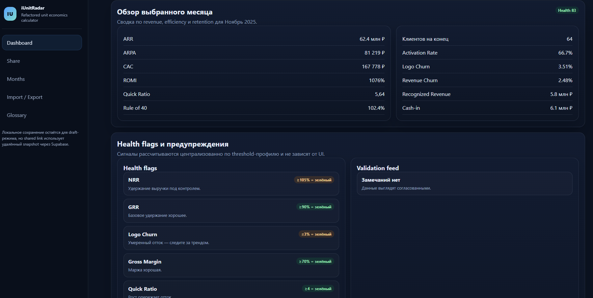

# iUnitRadar — калькулятор unit economics для B2B SaaS

**Продукт:** веб-калькулятор unit economics B2B SaaS  
**Роль:** Product Manager / Builder  
**Контекст:** hands-on инструмент для product analytics и финансовых решений

**Результат:** MRR/ARR → LTV/CAC → payback → Rule of 40 → health score. Сравнение сценариев и шаринг по ссылке.

**Демо:** [addito-5g.github.io/iUnitRadar_v1](https://addito-5g.github.io/iUnitRadar_v1/)



---

## Зачем

Собран так, как PM использует analytics на практике: входные данные → метрики для решений → валидация → сравнение сценариев — до commitment в roadmap или бюджет.

## Возможности

- **Метрики:** MRR/ARR, churn, GRR/NRR, CAC, LTV, payback, gross margin, ROMI, Rule of 40, health score
- **Демо-сценарий:** 3-месячный пример B2B SaaS (контекст селлеров МП)
- **Шаринг:** URL `?calc=<uuid>` через Supabase
- **Тесты:** `npm test` на core-расчётах
- **Архитектура:** pure functions, отделённый UI, ES modules без сборщика

## Стек

Vanilla JS · CSS · Supabase · GitHub Pages

## Запуск

```bash
# 1. Supabase: выполнить supabase/schema.sql
# 2. config.example.js → config.js
npm start   # или npx serve .
npm test
```

## Методология

- **LTV:** `(ARPA × Gross Margin %) / Logo Churn Rate`
- **ROMI:** эффективность на базе LTV/CAC, не campaign-period ROMI
- Подробности — в глоссарии приложения (Справочник)

## Структура

- `src/lib/` — расчёты, валидация, export
- `src/state/` — store, local storage
- `src/features/` — dashboard, editor, share
- `tests/` — unit tests

---

*Прозрачные формулы, редактируемые пороги, import/export, шаринг без собственного backend.*
